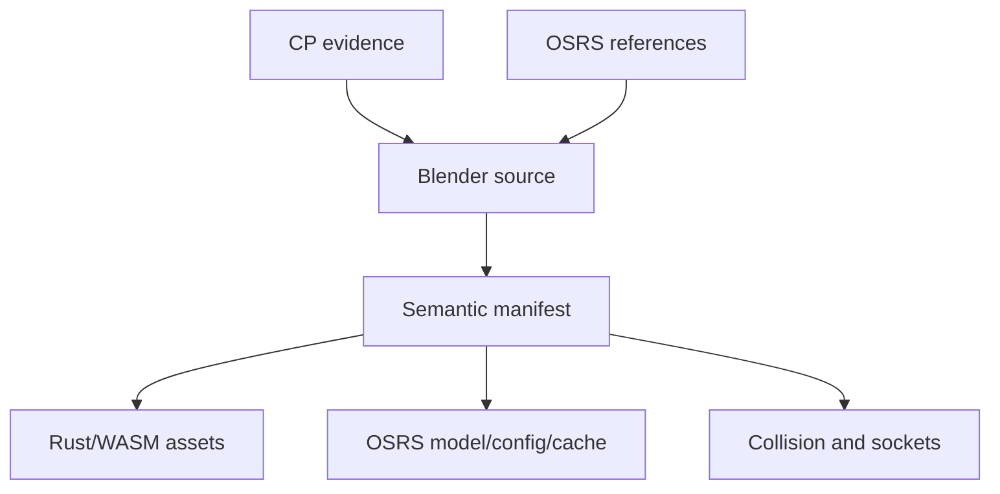

# Blender and Asset Guide

This file defines how Club Penguin-inspired assets become original assets matching the frozen OSRS revision and rendering consistently in the Rust/WASM and RuneLite clients.

## Visual target

The frozen OSRS revision is the canonical visual target. New assets should look native to that exact revision at ordinary camera distance while immediately reading as Club Penguin-inspired.

- Preserve recognizable silhouettes, colors, signs, props, layouts, and characteristic motions.
- Translate round 2D art into the selected revision's geometry density, compact proportions, faceting, strong silhouettes, and readable color blocks.
- Match the selected revision's face-color/texture conventions, restrained lighting, animation cadence, palette discipline, and visual rhythm.
- Do not introduce richer web-only geometry, modern materials, smoother animation, or texture detail that requires a reduced RuneLite version.
- Avoid realistic PBR rendering, dense subdivision, close-up-only details, and animation that departs from the selected revision.
- Treat clickboxes, collision, interaction footprint, and gameplay tile occupancy separately from decorative overhang.

Author one target-independent canonical source and generate deterministic web and RuneLite outputs representing the same geometry, colors/textures, animations, UI art, lighting assumptions, and composition. Treat any required client-specific simplification or substitution as a compatibility blocker or owner-approved exception. Validate a shared screenshot corpus within predefined cross-renderer tolerances.

## Tool references

These are format and workflow references, not automatically trusted production converters.

| Repository | Stars at snapshot | Activity/version signal | Best use | Limitation |
|---|---:|---|---|---|
| [ConnorDY/OSRS-Environment-Exporter](https://github.com/ConnorDY/OSRS-Environment-Exporter) | 73 | Release 2.4.2; push observed 2026-06-16 | Export environments to Blender/glTF; compare 1:1, 1:100, and 1:128 scale modes | Verify rotations, materials, and cache support; not authoritative write-back |
| [Qodat/qodat](https://github.com/Qodat/qodat) | 32 | README describes editing as future work | Browse IDs/colors and export player, NPC, object, SFX, and animation data | Explorer/exporter, not a production cache editor |
| [tamateea/RuneBlend](https://github.com/tamateea/RuneBlend) | 21 | Claims all OSRS model formats; skeleton/textures WIP | Import `.dat`, palettes, alpha, and vertex groups | Skeletons may decode incorrectly; write-back unproven |
| [Bram91/Model-Dumper](https://github.com/Bram91/Model-Dumper) | 18 | RuneLite OBJ/MTL sequence plugin | Observe live player, NPC, object, ground-item models and frames | OBJ frames cannot preserve all OSRS metadata |
| [ScreteMonge/creators-kit](https://github.com/ScreteMonge/creators-kit) | Recheck | 532 commits; plugin metadata 2.3.1 | Spawn, combine, animate, program, and export cache/custom models in RuneLite scenes | Interactive creation/preview, not proof of cache-safe round trip |
| [ScreteMonge/Blender-Addons](https://github.com/ScreteMonge/Blender-Addons) | 3 | 25 commits inspected | Creator's Kit JSON to/from Blender experiment; exposes 1/128 and triangle constraints | Exporter described as primitive; animation unsupported |
| [Rooseelvis/blender-addon-rs317-667mqo-makeup](https://github.com/Rooseelvis/blender-addon-rs317-667mqo-makeup) | 1 | README 7.7.0, Blender 4.5+; push 2026-02-07 | Experimental VSKIN, priority, TSKIN, PMN, and `.dat` tooling | Low adoption and self-reported compatibility; isolate and corpus-test |
| [Displee/rs-cache-library](https://github.com/Displee/rs-cache-library) | Recheck | Exact head required | Cache write/manipulation comparison | General support does not prove custom-model compatibility |

Also inspect exact selected-revision RuneLite cache/model classes and the selected cache. Triangulate model interpretation through more than one reader for the validation corpus.

## Canonical asset record

Every authored asset needs one manifest entry:

| Field | Required content |
|---|---|
| Semantic ID | Stable project identifier independent of cache numbers |
| Source evidence | CP era/date, room/game/item, media filename or symbol/frame, hashes |
| OSRS references | Comparable object/NPC/item/model IDs and selected cache |
| Design intent | Club Penguin traits preserved and OSRS conventions applied |
| Blender source | `.blend` hash, Blender version, units, axes, collection/object names |
| Geometry | Triangles, vertices, origin, bounds, footprint, priority needs |
| Appearance | Face colors, textures, alpha, recolors, lighting assumptions |
| Animation | Skin/skeleton groups, semantic clips, frames, tick timing |
| Attachment | Held-item, off-hand, head, cape/back, feet, effect/projectile sockets |
| Client outputs | Web asset hash and OSRS model/config/cache IDs/hashes |
| Validation | Blender, decoded output, RuneLite, and WASM captures/errors |

## Preliminary complexity bands

These are starting budgets for readability and throughput, not discovered engine limits. Replace them with corpus-tested limits once known.

| Asset class | Initial triangle target | Notes |
|---|---:|---|
| Inventory/ground item | 20–300 | Silhouette must remain readable at inventory and ground scale |
| Simple prop | 40–500 | Signs may use verified textures or modeled color blocks |
| Complex interactive object | 150–1,200 | Split moving components; keep clickbox independent |
| Penguin base body | 300–1,200 | Stable seams and skin groups matter more than density |
| Wearable component | 40–800 | Full-body costumes may exceed individual-slot targets |
| NPC/creature | 250–1,500 | Budget animation groups and silhouette together |
| Environment set piece | 300–3,000 | Split by culling/collision units and test scene cost |

An asset may exceed its band with a recorded reason and performance evidence. Low triangle count alone is not success if face priorities, skin groups, or silhouette fail.

## Canonical penguin body

Build one neutral equipment platform with stable seams for:

- head, crest, beak, and face;
- torso and belly;
- left/right flippers;
- lower body;
- left/right feet.

This is the single player skeleton, proportion set, equipment envelope, collision footprint, and animation basis. Do not make editor-selectable tall, short, wide, narrow, or differently jointed body variants. Palette changes, markings, facial treatments, and modular crest, beak, belly, flipper, or foot parts are allowed only when they preserve the canonical silhouette range, attachment sockets, seam locations, skin groups, equipment clearances, and animation behavior.

Required sockets:

- head/hat center;
- face/beak accessory;
- neck/front chest;
- held weapon/tool;
- off-hand/shield;
- cape/back;
- left/right feet;
- projectile/effect origin;
- overhead/chathead reference.

Required base poses and clips:

- idle, walk, run, turn;
- attack styles, block, death;
- common skilling cycles;
- sit and social idle;
- OSRS emotes;
- minigame-specific temporary stance tests.

Ordinary smooth Blender weights may not map losslessly to legacy vertex skin groups. Design deformation around the actual target representation rather than expecting the exporter to approximate it later.

## Equipment-fit rules

1. Preserve each OSRS item's recognizable identity and variant/recolor behavior.
2. Fit to standardized sockets and seam boundaries before adding per-item exceptions.
3. Define which base body parts are hidden by each worn model.
4. Test beak, belly, flipper, cape, robe, and two-handed clearances through full animation arcs.
5. Store overrides in data, not one-off exporter code.
6. Review front, back, and diagonal views at game camera distance.

Recommended equipment mapping record:

```text
original_item_id
original_variant_ids[]
slot
penguin_model_ids[]
hidden_body_parts[]
attachment_socket
recolor_mapping
animation_overrides
known_clipping
runelite_status
wasm_status
review_status
```

Parameterized families should cover most metal armor, robes, capes, boots, gloves, masks, bows, staves, shields, melee weapons, and two-handed weapons. Family generation never removes the need for exception review.

## Blender scene conventions

Confirm these with a cube, one OSRS tile, a known object, and the base penguin before bulk work:

1. Keep untouched source references in separate, non-exported collections.
2. Record units, axes, handedness, tile scale, and the exact transform into target coordinates.
3. Several tools expose a 1/128 conversion; test rather than assume it is the correct canonical scale.
4. Place the gameplay ground pivot explicitly.
5. Name meshes, armatures/groups, clips, sockets, collision proxies, and LOD/export variants deterministically.
6. Apply transforms only through the controlled export workflow.
7. Triangulate deterministically and inspect normals with back-face culling.
8. Keep collision and clickbox proxies separate from visible meshes.
9. Store OSRS-specific properties as structured custom data or a sidecar—not only Blender material names.
10. Version a palette swatch, lighting reference, camera reference, and penguin-size reference scene.
11. Pin Blender and run export headlessly in CI.
12. Treat `.blend` plus semantic manifest as canonical source; all client artifacts are generated.

## OSRS metadata that must survive

- per-face color;
- texture IDs and texture coordinates/triangles where applicable;
- alpha/transparency;
- render priority and render type;
- vertex skin/group assignments;
- face/texture skin data where used;
- recolor and retexture channels;
- animation/skeleton/frame relationships;
- model/config links and variant IDs;
- bounds, origin, and scale;
- deterministic triangle ordering where rendering depends on it.

OBJ is useful for visual geometry comparison but cannot be the canonical interchange because it loses much of this information.

## Dual-output export



- Use a project-owned neutral intermediate generated from Blender and the manifest.
- glTF/GLB can carry web geometry and materials, but OSRS-only data requires extensions or a sidecar.
- Generate both client formats from the same semantic input.
- Keep stable semantic IDs independent of revision-specific cache IDs.
- Never make manually edited cache bytes the source of truth.
- Rebuilding from `.blend`, manifest, exporter SHA, and base-cache identity must produce identical hashes.

## Validation corpus

Do not bulk-produce assets until these pass:

- opaque palette-colored prop;
- textured or transparent object with sensitive face ordering;
- base penguin idle/walk/run;
- weapon, shield, cape, full helmet, robe, and two-handed item;
- every player-editor recolor channel;
- one chathead/dialogue animation;
- one animated minigame prop or NPC;
- one room/region with collision, clickboxes, and interactions.

Compare Blender, decoded target output, RuneLite, and WASM for:

- image/silhouette;
- face ordering, color, texture, alpha, and lighting;
- animation frame and tick timing;
- bounds, pivots, sockets, and projectiles;
- collision and clickbox behavior;
- semantic/config IDs;
- deterministic hashes.

Fail export on out-of-range coordinates, non-triangles, inverted normals, missing metadata, unstable ordering/hashes, unsupported weights, palette drift, ID collisions, or incomplete equipment mappings.

## Club Penguin-to-OSRS authoring loop

1. Identify the exact Club Penguin room, item, character, or animation era.
2. Hash/catalog the relevant media and capture ordinary gameplay views.
3. Observe timing in a pinned Ruffle build and inspect symbols/timelines in pinned JPEXS when necessary.
4. Export comparable OSRS assets from the selected cache through at least two readers for critical format tests.
5. Block silhouette at actual game camera scale.
6. Apply OSRS facet, palette, proportion, and detail discipline.
7. Fit penguin seams and sockets before finishing equipment detail.
8. Encode target metadata explicitly.
9. Export both clients deterministically.
10. Review side-by-side captures and record exceptions.

## RuneLite compatibility boundary

Custom penguin bodies, appearance kits, models, configs, and interfaces cannot be assumed to work with an entirely stock RuneLite installation and stock Jagex cache. For each asset class, record whether delivery requires:

- only ordinary server state understood by stock RuneLite;
- a custom cache/content build accepted by the compatible client route;
- translation through the shim;
- a RuneLite plugin;
- behavior unavailable until a proof-of-compatibility test passes.

Creator's Kit is useful for previews. It is not evidence that the final unmodified-client/custom-cache path works.
